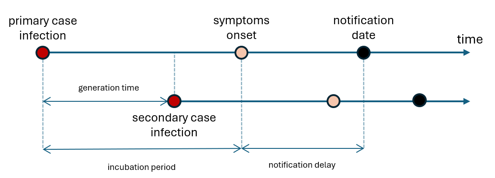

```{r setup, include=FALSE}
knitr::opts_chunk$set(echo = TRUE)
knitr::opts_knit$set(root.dir = here::here())
```


Real time public health surveillance is subject to retrospective upward 
corrections due to the presence of occurred but not yet reported events, 
which reflects on the epidemic curves as a downward bias that should be corrected 
in order to enhance situational awareness and inform public health officials and 
decision making 
([Gunther, Felix, et al. 2021](https://onlinelibrary.wiley.com/doi/full/10.1002/bimj.202000112)). 
Statistical nowcasting methods aim to uncover current trends, predicting how 
strongly the preliminary data will be corrected once reporting catches up 
([Wolfram, Daniel, et al. 2023](https://journals.plos.org/ploscompbiol/article?id=10.1371/journal.pcbi.1011394)). 
This can be of use to estimate the actual current needs of a public health system, 
informing about e.g. how many tests need to be deployed or how many hospitalizations 
are expected today.

# Methods 

Nowcasting methods estimate the total number of cases occurred on recent days 
given the information available at the current date. For this end, a wide 
variety of hierarchical Bayesian models can be implemented to estimate the 
currently missing reported cases computed as the difference between the available 
cases and the total number of cases occurred on the targeted day 
([Höhle, M., & an der Heiden, M, 2014](https://onlinelibrary.wiley.com/doi/full/10.1111/biom.12194?casa_token=ScugUpQiLyYAAAAA%3AbbkkKlruJIj9ahoBxT_ZPlecikdK1sQBPnIN-WabiYLHsIzKC-ZFMXNn4W5ufqu9l3aEIZOCPEeCnv9V)). 

More concretely, nowcasting methods estimate the total number of cases ocurred 
on day $t\in[1,T]$ given the information available at the current day $T$. For 
this end, consider the number of cases which occur on day $t$ and become 
available with a delay of $d\in[0,D]$ days, denoted as $n_{t,d}$; here $D$ 
represents the maximum delay to be considered. Following the notation in 
[Höhle, M., & an der Heiden, M, 2014](https://onlinelibrary.wiley.com/doi/full/10.1111/biom.12194?casa_token=ScugUpQiLyYAAAAA%3AbbkkKlruJIj9ahoBxT_ZPlecikdK1sQBPnIN-WabiYLHsIzKC-ZFMXNn4W5ufqu9l3aEIZOCPEeCnv9V), 
we denote the cases occurred on day $t$ that were reported until day $T$ as 
$N(t,T)$. Then the total number of cases occurred on day $t\in[T-D, ..., T]$ 
is given by:
$$
\lambda_{t} := N(t, \infty) \approx \sum_{d=0}^D n_{t,d},
$$
such that the currently missing reported cases are given by the difference $N(t,\infty) - N(t,T)$.

In order to predict the unknown total of cases from the delayed observations, 
a wide variety of hierarchical Bayesian models can be implemented. These models 
typically consist of parts that can be flexibly specified. For instance, in 
([Gunther, Felix, et al. 2021](https://onlinelibrary.wiley.com/doi/full/10.1002/bimj.202000112)) 
a negative binomial model for the delayed cases was used for nowcasting the 
incidence of COVID-19 in Bavaria:

$$
\begin{align*}\log(\lambda_0)&\sim N(0,1) \\ \log(\lambda_t)|\lambda_{t-1}&\sim N(\log(\lambda_{t-1}),\sigma^2)\\ n_{t,d}|\lambda_t,p_{t,d} &\sim NegBinom(\lambda_t p_{t,d}, \phi)\end{align*}
$$

This model was implemented by means of MCMC estimations using 
*[Stan](https://mc-stan.org/users/documentation/)* (the source code can be found [here](https://github.com/FelixGuenther/nc_covid19_bavaria/tree/master)). 

Nowcasting techniques were also employed during the COVID-19 pandemic to inform 
public health systems. In 
[Wolfram, Daniel, et al. (2023)](https://www.medrxiv.org/content/10.1101/2023.04.17.23288668v1) 
a wide variety of nowcasting models for COVID-19 hospitalization incidence in 
Germany are summarized and jointly analyzed. Most of the models considered there 
assume that the delay distribution remains roughly constant.

In this tutorial we implement a simple Nowcasting pipeline using snapshots for 
COVID-19 incidence of cases from Bogotá city by means of the R package {EpiNow2}, 
correcting for right truncation bias due to notification delay, as well as for 
biological delays informed from the available literature.

# Basic Nowcasting pipeline with {EpiNow2}

## Load packages

```{r, message=FALSE, warning=FALSE}
library(dplyr)
library(ggplot2)
library(grates)
library(rstan)
library(EpiNow2)
```

```{r ggplot theme, echo=FALSE}
theme_set(theme_bw(base_size = 12))
```

To set parallel running with half the cores of your machine:
```{r set parallel, eval=TRUE}
options(mc.cores=parallel::detectCores()/2)
```

The optimal value will depend on your available computational resources. 

## Read data
Before running the code in this section, make sure that you have downloaded 
both the historic COVID-19 datasets for Bogotá/Medellín, and the updated data. 
You can do so by running the `download_col_legacy_data.R` and 
`download_covid19_data.R` scripts respectively.

```{r download data, eval=FALSE}
source("./scripts/download_col_legacy_data.R")
source("./scripts/download_covid19_data.R")
```

This will download and concatenate the historic COVID-19 daily incidence data that was available during the pandemic for every week between 2020-04-07 and 2020-08-25 for this two locations, and download the up-to-date version of the COVID-19 data for Colombia.

### Reading and preparing the legacy data

```{r read legacy data, echo=FALSE}
df_incidence_daily <- read.csv("./data/covid19_col_legacy_onset_daily_incidence.csv") %>%
  mutate(
    register = as.Date(register),
    onset = as.Date(onset)
  ) %>%
  rbind(
    read.csv("./data/covid19_cases_deaths_daily.csv") %>%
      rename(
        onset = date,
        incidence = cases
        ) %>%
      mutate(register = max(onset)) %>%
      select(c(city, register, onset, incidence)) 
  ) %>%
  filter(city == "Bogota") %>%
  group_by(register) %>%
  slice(1:(n()-14)) %>%
  filter(as.Date(onset) <= as.Date("2020-09-25")) %>%
  mutate(register = max(onset)) %>%
  ungroup()
```

Note that we remove data from the last 14 days for each reporting date. This is to avoid underestimations of current cases due to extremely low incidence values. The effect of this is to effectively shift the reporting dates, which will be taken as the last onset date for each snapshot. 

In figure 1 we plot the weekly incidence of cases. It is clear there is a right-truncation bias present in the snapshots of the data

```{r legacy data plot, echo=FALSE, message=FALSE, results='hide'}
df_incidence_weekly <- df_incidence_daily %>%
  mutate(
    epiweek = grates::as_epiweek(.$onset)
  ) %>%
  group_by(city, register, epiweek) %>%
  summarize(incidence = sum(incidence)) %>%
  ungroup() %>%
  mutate(
    labels = case_when(
      register == max(register) ~ "Updated",
      TRUE ~ as.character(register)
    )
  )

ggplot(data = df_incidence_weekly,
  aes(
    x = epiweek, y = incidence,
    group = register,
    colour = as.factor(labels)
    )
  ) +
  geom_point() +
  geom_line() +
  labs(
    x = "Date of onset", y = "Confirmed cases",
    color = "Register date"
    ) +
  scale_fill_discrete(
    labels = labels
  ) +
  theme(
    legend.position = "bottom",
    axis.text.x = element_text(angle = 90, vjust = 0.5, hjust=1),
    strip.text = element_text(size = 14)
    )
```
\
**Figure 1.** Snapshots of confirmed cases of COVID-19 by date of onset in 
Bogotá D.C. along with the updated reported cases by onset.

Now, we want to correct this right truncation bias and estimate the actual number of cases for the last snapshot. To do this, we first need to correctly specify the distributions describing of the different delays present in the data. The reporting delay we are corresponds to the time that passes from the moment an individual gets infected up to the time when the case is notified in an official channel. This delay can be split in two:

- **Incubation period:** Time elapsed from infection to symptoms onset
- **Notification delay:** The time from symptom onset to notification

Another important time interval that will be useful to correct this right truncation bias is known as the **generation time**, that corresponds to the time elapsed between the infection of an infector and an infectee. A schematic of these delays can be seen in figure 2.



## Estimating the delay distributions

### Estimating onset-notification delay distribution

In this section we use the individual data of Bogotá to estimate the notification delay,
computed as the time elapsed from onset to notification, by means of a simple 
Bayesian model. 
 
```{r delays list}
df_bog_individual <- read.csv("./data/covid19_col_updated_individual.csv") %>% 
  filter(city == "Bogota") %>%
  mutate(
    notification = as.Date(notification),
    onset = as.Date(onset),
    notification_delay = case_when(
      notification >= onset ~ notification - onset,
      TRUE ~ NA
    )
  ) %>%
  tidyr::drop_na(notification_delay)

delays_list <- as.integer(
  df_bog_individual$notification_delay
)
```

```{r, echo=FALSE}
rm(df_bog_individual)
```


### Assuming that the notification delay is distributed according to a log-normal distributionm:

```{r stan code delays}
stan_code <- '
data {
    int<lower=0> N;         // Number of data points
    real<lower=0> y[N];     // Data sample
}

parameters {
    real<lower=0> log_mu;       // Mean parameter
    real<lower=0> log_sigma;    // Standard deviation parameter
}

model {
    // Prior distribution for parameters
    log_mu ~ uniform(0, 10);     // Prior on mean
    log_sigma ~ uniform(0, 10);  // Prior on standard deviation

    // Likelihood function
    y ~ lognormal(log_mu, log_sigma);   // Log-normal likelihood
}
'

stan_model <- stan_model(model_code = stan_code)

stan_data <- list(
  N = length(delays_list),
  y = delays_list + 0.1 # Avoiding zeros in log
)
```

<!-- Estimating the parameters of the log-normal distribution with optimization: -->

```{r stan optimizing, eval=FALSE, echo=FALSE}
fit_optim <- rstan::optimizing(stan_model, stan_data)
mu_optim <- as.numeric(fit_optim$par[1])
sigma_optim <- as.numeric(fit_optim$par[2])
```

Estimating the parameters of the log-normal distribution with sampling:
```{r stan sampling, message=FALSE, results='hide'}
fit <- sampling(
  stan_model,
  data = stan_data,
  chains = 4,
  iter = 800,
  warmup = 400
  )
```

Extracting parameters from sampling:

```{r extract parameters}
parameter_samples <- rstan::extract(fit)
log_mu <- mean(parameter_samples$log_mu)
log_sigma <- mean(parameter_samples$log_sigma)
```

The resulting distribution is plotted in figure 3.

```{r plot notification delay, echo=FALSE, warning=FALSE}
ggplot() +
  geom_histogram(
    aes(x = delays_list, y = ..density..)
    ) +
  stat_function(
    fun = dlnorm,
    args = list(mean = log_mu, sd = log_sigma)
  ) +
  labs(x = "delay")
```
\
**Figure 3.** Estimated notification delay log-normal distribution.

Now we can define the notification delay distribution by means of the `dist_spec`
function:

```{r define notification delay, warning=FALSE}
notification_delay <- dist_spec(
  mean = log_mu,
  sd = log_sigma,
  max = 50,
  dist = "lognormal"
)
```

## Defining the incubation period distribution

The incubation period distribution can be specified referring to reported values
in the academic literature:

```{r define incubation period, warning=FALSE}
incubation_period <- dist_spec(
  # https://epiforecasts.io/covid/methods
  mean = 5.2, mean_sd = 1.1,
  sd = 1.52, sd_sd = 1.1,
  distribution = "gamma",
  max = 10
)
```

```{r define delay distribution}
delay <- incubation_period + notification_delay
```

## Defining the generation time distribution

Similarly, for the generation time:

```{r define generation time}
generation_time <- dist_spec(
  # https://www.eurosurveillance.org/content/10.2807/1560-7917.ES.2020.25.17.2000257?crawler=true
  mean = 3.6, mean_sd = 0.7,
  sd = 3.1, sd_sd = 0.8,
  distribution = "gamma",
  max = 10
)
```

## Defining effective reproduction number priors

We can also specify prior distributions for the effective reproduction number:

```{r define rt priors}
rt_prior <- list(
  # Taken from Rt-EpiEstim.Rmd
  mean = 3.918,
  sd = 0.327
)
```

## Estimating the truncation distribution from historical data

By means of the function `estimate_truncation` we can estimate the truncation distribution from the snapshots of the data:

```{r estimate truncation}
trunc_dates <- unique(df_incidence_daily$register)
trunc_data <- list()
for(i in 2:(length(trunc_dates)-1)) {
  trunc_data[[i-1]] <- df_incidence_daily %>%
    filter(
      register == trunc_dates[i]
      ) %>%
    select(-city, -register) %>%
    rename(
      date = onset,
      confirm = incidence
    )
}

est_trunc <- estimate_truncation(
  trunc_data,
  verbose = interactive()
)
```

<!--
```{r plot truncation, echo=FALSE}
plot(est_trunc)
```
-->

## Implementing the model

### Prepare the data for modelling

```{r prepare data}
df_real <- df_incidence_daily %>%
    filter(
      register == max(register)
      ) %>%
    select(-city, -register) %>%
    rename(
      date = onset,
      confirm = incidence
    )


reported_cases <- df_incidence_daily[df_incidence_daily$register != max(df_incidence_daily$register), ] %>%
  filter(
    register == max(register)
    ) %>%
  select(onset, incidence) %>%
  rename(
    date = onset,
    confirm = incidence
  )
```


## Estimating infections correcting for truncation

```{r estimate infections, warning=FALSE}
def_trunc <- estimate_infections(
  reported_cases,
  generation_time = generation_time_opts(generation_time),
  delays = delay_opts(delay),
  rt = rt_opts(prior = rt_prior),
  truncation = trunc_opts(est_trunc$dist)
)
```

Summaries for the different estimations performed by {EpiNow2} can be accessed 
formatting and filtering `def_trunc`. For instance, the estimated reported cases by onset 
date can be accessed as (see figure 4):
```{r, warning=FALSE}
onset_summary <- def_trunc$summarised %>% data.table::setDT() %>% filter(variable == "reported_cases")
```

```{r, echo=FALSE, warning=FALSE, results='hide', message=FALSE}
plot_estimates(
  onset_summary,
  def_trunc$observations %>% data.table::setDT()
  ) +
  geom_line(
    data = df_real %>% filter(),
    aes(x = date, y = confirm),
    inherit.aes = FALSE
  ) + 
  labs(
    x = "Date of onset", y = "Cases"
  ) +
  xlim(min(onset_summary$date), max(onset_summary$date))
```
\
**Figure 4.** Nowcasting estimation of reported cases by date of onset correcting
for right truncation bias.

For times beyond the register date (vertical dashed line), the number of 
infections is estimated by {EpiNow2} fitting an exponential curve to the final 
week of data and extrapolating this for 7 additional days (blue). The black 
curve in figure 4 represents the updated incidence of cases by date of onset. 
For a more detailed exploration of forecasting methods see the 
[*https://github.com/TRACE-LAC/pet-epi-notebooks/blob/main/notebooks/proyeccion_sktime_epi_mc.ipynb*](https://github.com/TRACE-LAC/pet-epi-notebooks/blob/main/notebooks/proyeccion_sktime_epi_mc.ipynb) 
notebook.

Similarly, for the estimated cases by date of infection:

```{r}
infection_summary <- def_trunc$summarised %>% data.table::setDT() %>% filter(variable == "infections")
```

```{r, echo=FALSE, warning=FALSE, results='hide', message=FALSE}
plot_estimates(
  infection_summary,
  def_trunc$observations %>% data.table::setDT()
  ) +
  labs(
    x = "Date of infection", y = "Estimated observed infections",
    inherit.aes = FALSE
  ) +
  xlim(min(infection_summary$date), max(infection_summary$date)) +
  ylim(0, 10000)
```
\
**Figure 5.** Nowcasting estimation of observed infections by date of infection 
correcting for right truncation bias.


$R_t$ estimations were also performed by `estimate_infections` using the renewal 
equation (see [the function's vignettes](https://epiforecasts.io/EpiNow2/dev/articles/estimate_infections.html)
for further details)

```{r, warning=FALSE}
rt_summary <- def_trunc$summarised %>% data.table::setDT() %>% filter(variable == "R")
```

```{r, echo=FALSE, warning=FALSE, results='hide', message=FALSE}
rt_epiestim <- read.csv("./data/rt_regions.csv") %>%
      mutate(date = as.Date(window_start)) %>%
      filter(city == "Bogota")

plot_estimates(
  rt_summary,
  hline = 1
  ) +
  geom_line(
    data = rt_epiestim,
    aes(x = date, y = rt_mean),
    inherit.aes =FALSE
  ) +
  labs(
    y = "Effective reproduction number",
    inherit.aes =FALSE
  ) +
  xlim(min(rt_summary$date), max(rt_summary$date)) +
  ylim(-0.5, 4)
```
\
**Figure 6.** Estimated $R_t$ using {EpiNow2}. The black line represents the 
$R_t$ estimated using {EpiEstim} (see the 
[*Effective Reproduction Number*](https://github.com/TRACE-LAC/pet-epi-notebooks/blob/main/notebooks/Rt-EpiEstim.Rmd)
notebook for further details).

