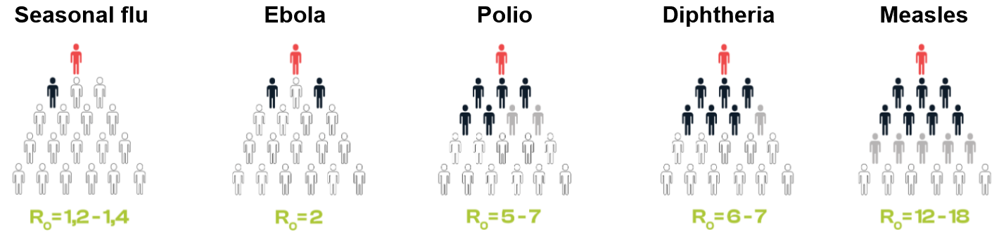
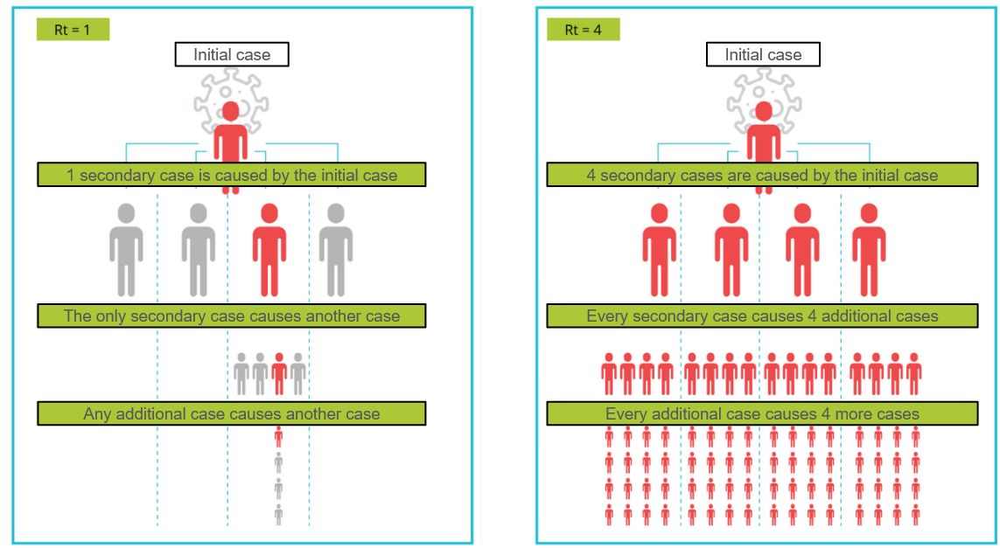

```{r setup, include=FALSE}
knitr::opts_chunk$set(echo = TRUE)
knitr::opts_knit$set(root.dir = here::here())
```


To assess the speed at which an infection spreads in a population is an important task when informing public health response to an epidemic. Reproduction numbers are typical metrics for monitoring and controlling the development of epidemics as they are informative of their spread rate ([Batista M. 2021](https://www.tandfonline.com/doi/full/10.1080/17513758.2021.2001584)). These are strongly related to the serial interval (SI), i.e. the distribution of the time elapsed between symptoms onset of a primary case and that of its secondary cases ([Forsberg White L. et al. 2008](https://pubmed.ncbi.nlm.nih.gov/18058829/)), which is commonly estimated by means of detailed contact tracing data.

# Basic reproduction number

The basic reproduction number $R_0$ represents the average number of secondary cases produced by an infectious individual in a completely susceptible population ([Ferrari et al. 2005](https://www.sciencedirect.com/science/article/abs/pii/S0025556405001501)). Values lesser than $1$ indicates that an outbreak will not cause an epidemic in the absence of imported cases, meanwhile $R_0> 1$ warns about the potential of the disease to produce a large outbreak, indicating a possibly exponential growth. The basic reproduction number is given by ([T. Britton and G. S. Tomba, 2019](https://royalsocietypublishing.org/doi/epdf/10.1098/rsif.2018.0670)):

$$
R_0 = \int_0^\infty \beta(s)ds,
$$
where $\beta(s)$ is the average rate at which an infected individual infects others after a time $s$ from infection. Likelihood based methods are commonly employed for real time estimation of the reproduction number and the SI from case notification and contact tracing data; however, the latter is commonly hard and expensive to collect, which difficults the estimation of the SI in real time scenarios (L. F. White and M. Pagano, 2020). In figure 1 you can see the value of the basic reproduction number for various infectious diseases and how this impacts the speed at which the diseases spread in the population.

<center>



</center>

# Instantaneous Reproduction Number

Although $R_0$ can be useful to characterize the transmissibility of a disease and to predict the size and resources required to face it ([Fraser et al. 2004](https://www.pnas.org/doi/epdf/10.1073/pnas.0307506101)), the assumption of complete susceptibility only holds for early stages of epidemics. The instantaneous reproduction number $R_t$ describes the average number of secondary cases generated by infectious individuals at time $t$ assuming no changes to current conditions. This is commonly employed to characterize spread in real time ([L. F. White and M. Pagano, 2020](https://academic.oup.com/aje/article/190/4/611/5919885)). Two schematic examples are shown in figure 2, illustrating how different values of $R_t$ are reflected on how the a disease is spread.

<center>



</center>

Assuming that transmission follows a Poisson process ([C. Fraser, 2007](https://journals.plos.org/plosone/article?id=10.1371/journal.pone.0000758)), and that infected individuals have a time dependent infective profile given by the SI distribution $\omega_t$, the instantaneous reproduction number can be estimated by sampling the the mean incidence $I_t$ by means of the renewal equation:

$$
I_t \sim Poisson\left(R_t \sum_{\tau=0}^{t-1} I_{t-\tau}\omega_t\right).
$$

This method is implemented in the R package {EpiEstim}, that allows the estimation of $R_t$ from incidence data through parametric and non-parametric methods within a Bayesian framework ([A. Cori, et al. 2013](https://academic.oup.com/aje/article-abstract/178/9/1505/89262)). In the next section you will see a basic pipeline to compute the effective reproduction number using this R package.

# Computing $R_t$

First, we load the packages we will require for the analysis:

```{r load libraries, message=FALSE, warning=FALSE}
library(dplyr)
library(ggplot2)
library(EpiEstim)
```

```{r set theme, echo=FALSE}
theme_set(theme_bw(base_size = 14))
```


The package{dplyr} provides useful functions to manipulate data and includes the pipe symbol `%>%`, {ggplot2} is a visualization package following the principles of [The Grammar of Graphics](https://citeseerx.ist.psu.edu/document?repid=rep1&type=pdf&doi=7f3e2207d2ef8fc0cee74069879c8adf35303a91), and {EpiEstim} is a tool to estimate $R_t$ from epidemic data ([R. K. Nash et al. 2022](https://journals.plos.org/digitalhealth/article?id=10.1371/journal.pdig.0000052)).

## Read data

Before running the code in this section, make sure that you have downloaded the COVID-19 public datasets from the selected locations. You can do so by running the `download_covid19_data.R` script:

```{r, eval=FALSE}
source("./scripts/download_covid19_data.R")
```

This will download and group the data to obtain daily and weekly incidence cases and deaths by location. To illustrate how to compute the effective reproduction number using {EpiEstim} we will use daily incidence data up to the end of 2022

```{r read covid19 data}
df_covid19_daily <- read.csv("./data/covid19_cases_deaths_daily.csv") %>%
  mutate(date = as.Date(date)) %>%
  filter(date <= as.Date("2022-12-31"))
```


A plot of the daily incidence of cases for each available location can be seen in the following figure
```{r plot cases, echo=FALSE, out.width="800px",out.height="800px"}
ggplot(
  data = df_covid19_daily %>% 
    filter(city != "Santiago"),
  aes(x = date)
  ) +
  geom_line(aes(y = cases)) +
  facet_wrap(~city, scales = "free_y", ncol = 1) +
  labs(x = "Date of onset", y = "Confirmed cases") +
  theme(
    legend.position="bottom",
    strip.background = element_rect(fill="white"),
    strip.text = element_text(size = 14)
    )
```

## Estimating $R_t$ with {EpiEstim}

### Preparing the data

Take a closer look to the incidence data for Medellín city, Colombia:

```{r data summary}
str(df_covid19_daily %>% filter(city == "Medellin"))
```
Note that there are some dates missing. {EpiEstim} requires as an input a `data.frame` object with a value of incidence for each date between the initial and final date. The function `complete_dates()` serve to fill the missing incidence data with zeros:

```{r complete_dates function}
# complete missing dates
complete_dates <- function(df) {
  all_dates <- data.frame(
    infection = seq.Date(
      min(df$infection, na.rm = TRUE),
      max(df$infection, na.rm = TRUE),
      by = "day"
    )
  )

  df <- left_join(all_dates, df)
  df <- df %>% replace(is.na(df), 0)
  return(df)
}
```

This function will be used later on to complete the dates prior to computing the $R_t$.

### Parameters

Here we use an incubation period of 5 days ([Natalie M Linton, et al. 2020](https://www.mdpi.com/2077-0383/9/2/538)), and a mean SI of 5.2(4.9, 5.5) as reported by [Muluneh Alene, et al. 2021](https://link.springer.com/article/10.1186/s12879-021-05950-x). The incubation period is used to shift the onset of symptoms to estimate the infection date (we assume the reported date across the locations corresponds to onset of symptoms, which may not be the case; this is only for illustrative purposes). 

```{r}
rt_window <- 14
incubation_period <- 5
mean_si <- 5.2
std_si <- 0.3
```

### Computing $R_t$

The function `compute_rt()` uses `EpiEstim::estimate_R()` to compute $R_t$ from a given incidence data frame:

```{r compute_rt function}
compute_rt <- function(
  df_incidence,
  method = "parametric_si",
  mean_si, # Mean serial interval
  std_si, # Standard deviation of the serial interval
  rt_window, # Time window length
  incubation_period # Incubation period
) {
  t_start <- seq(incubation_period, nrow(df_incidence) - rt_window)
  t_end <- t_start + rt_window

  rt_data <- estimate_R(
    df_incidence,
    method = method,
    config = make_config(
      list(
        mean_si = mean_si,
        std_si = std_si,
        t_start = t_start,
        t_end = t_end
      )
    )
  )

  df_rt <- rt_data$R
  df_rt$window_start <- min(df_incidence$infection) + df_rt$t_start
  df_rt$window_end <- min(df_incidence$infection) + df_rt$t_end

  return(df_rt)
}
```

```{r compute Rt, message=FALSE, warning=FALSE}
df_covid19_daily$infection <- df_covid19_daily$date - incubation_period

df_rt <- data.frame()
cities <- df_covid19_daily$city %>% unique()
for (city_ in cities){
  print(paste0("Computing Rt for ", city_))
  df <- df_covid19_daily %>% filter(city == city_) %>%
    select(c('infection', 'cases')) %>%
    rename(I = cases) %>%
    complete_dates()

  df_rt_ <- df %>% compute_rt(
    rt_window = rt_window,
    mean_si = mean_si,
    std_si = std_si,
    incubation_period = incubation_period
  ) %>%
    mutate(city = city_)

  df_rt <- rbind(df_rt, df_rt_)
  rm(df_rt_)
}
df_rt <- df_rt %>% select(c('city', 'window_start', 'window_end', 'Mean(R)', 'Quantile.0.05(R)', 'Quantile.0.975(R)'))
colnames(df_rt) <- c(c('city', 'window_start', 'window_end', 'rt_mean', 'rt_mean_lower', 'rt_mean_upper'))
```
```{r save Rt data, eval=FALSE, echo=FALSE}
write.csv(df_rt, "./data/rt_regions.csv")
```


### Plotting the results

```{r Plot Rt results, out.width="800px",out.height="800px"}
ggplot(
  data = df_rt %>% 
    filter(city != "Santiago"),
  aes(x = window_start)
  ) +
  geom_line(aes(y = rt_mean)) +
  geom_ribbon(
    aes(
      ymin = .data$rt_mean_lower,
      ymax = .data$rt_mean_upper
    ),
    alpha = 0.4
  ) +
  facet_wrap(~city, scales = "free", ncol = 1) +
  labs(x = "End of window", y = "Instantaneous reproduction number") +
  theme(
    strip.background = element_rect(fill="white"),
    strip.text = element_text(size = 14)
    )
```

